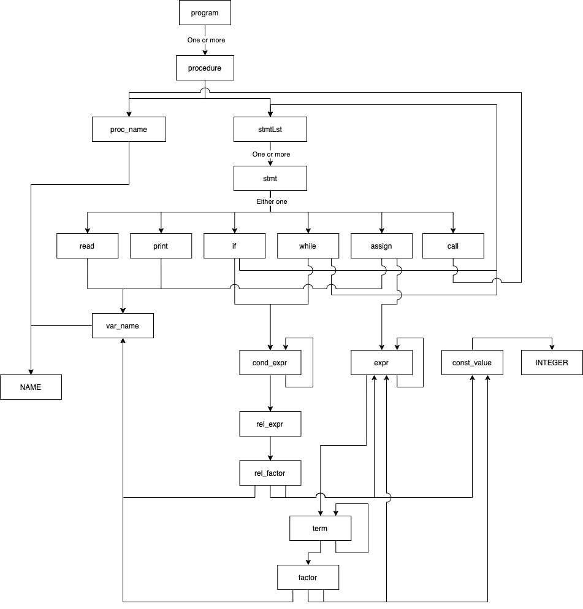

# Auto SIMPLE Code generator
## Introduction
When working on CS3203 (Software Engineering Project), we needed to develop a 
program analyser to analyse a new programing language called "SIMPLE". While 
developing the SIMPLE Program Analyser (SPA), we needed a way to quickly come up
with SIMPLE Programs to put our SPA through its paces. 

Here is where Project-Elmo comes in. We aim to provide a system to generate SIMPLE 
code quickly so we can remove the human bias element in the code generation.

## Overview 
Project-Elmo works by using the given set of SIMPLE concrete grammar. We are able to
Use that to build object models that would help us build our program.

  
SIMPLE Concrete Grammar

Meta symbols:

a* - repetition 0 or more times of a

a+ - repetition 1 or more times of a

a | b - a or b

brackets ( and ) are used for grouping

Lexical tokens:

LETTER: A-Z | a-z -- capital or small letter

DIGIT: 0-9

NAME: LETTER (LETTER | DIGIT)* -- procedure names and variables are strings of letters, and digits, starting with a letter

INTEGER: DIGIT+ -- constants are sequences of digits

Grammar rules:

program: procedure+

procedure: ‘procedure’ proc_name ‘{‘ stmtLst ‘}’

stmtLst: stmt+

stmt: read | print | call | while | if | assign

read: ‘read’ var_name’;’

print: ‘print’ var_name’;’

call: ‘call’ proc_name ‘;’

while: ‘while’ ‘(’ cond_expr ‘)’ ‘{‘ stmtLst ‘}’

if: ‘if’ ‘(’ cond_expr ‘)’ ‘then’ ‘{‘ stmtLst ‘}’ ‘else’ ‘{‘ stmtLst ‘}’

assign: var_name ‘=’ expr ‘;’

cond_expr: rel_expr | ‘!’ ‘(’ cond_expr ‘)’ | ‘(’ cond_expr ‘)’ ‘&&’ ‘(’ cond_expr ‘)’ | ‘(’ cond_expr ‘)’ ‘||’ ‘(’ cond_expr ‘)’

rel_expr: rel_factor ‘>’ rel_factor | rel_factor ‘>=’ rel_factor | rel_factor ‘<’ rel_factor | rel_factor ‘<=’ rel_factor | rel_factor ‘==’ rel_factor | rel_factor ‘!=’ rel_factor

rel_factor: var_name | const_value | expr

expr: expr ‘+’ term | expr ‘-’ term | term

term: term ‘*’ factor | term ‘/’ factor | term ‘%’ factor | factor

factor: var_name | const_value | ‘(’ expr ‘)’

var_name, proc_name: NAME

const_value: INTEGER

## Details

Looking through the grammar rules, we can see some patterns forming between the different
components. For example, Every program has 1 or more procedures. Below is a diagram of the
general flow of the grammar rules.

Though the diagram may look a little complicated, we can see some general patterns from it.

1. At the base of everything is a NAME or an INTEGER.
2. There are some pre-defined routes for everything.

### Architecture
For each box you see in the image above, they will have their own classes. Every class will 
have a "blueprint" of what should be done when creating the object (Classic OOP).