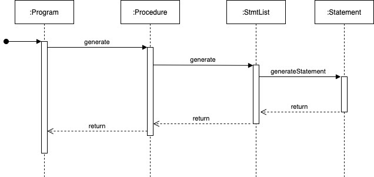

# Auto SIMPLE Code generator
## Introduction
When working on CS3203 (Software Engineering Project), we needed to develop a 
program analyser to analyse a new programing language called "SIMPLE". While 
developing the SIMPLE Program Analyser (SPA), we needed a way to quickly come up
with SIMPLE Programs to put our SPA through its paces. 

Here is where Project-Elmo comes in. We aim to provide a system to generate SIMPLE 
code quickly so we can remove the human bias element in the code generation.

## Overview 
Project-Elmo works by using the given set of SIMPLE concrete grammar. We are able to
Use that to build object models that would help us build our program.

  
SIMPLE Concrete Grammar

Meta symbols:

a* - repetition 0 or more times of a

a+ - repetition 1 or more times of a

a | b - a or b

brackets ( and ) are used for grouping

Lexical tokens:

LETTER: A-Z | a-z -- capital or small letter

DIGIT: 0-9

NAME: LETTER (LETTER | DIGIT)* -- procedure names and variables are strings of letters, and digits, starting with a letter

INTEGER: DIGIT+ -- constants are sequences of digits

Grammar rules:

program: procedure+

procedure: ‘procedure’ proc_name ‘{‘ stmtLst ‘}’

stmtLst: stmt+

stmt: read | print | call | while | if | assign

read: ‘read’ var_name’;’

print: ‘print’ var_name’;’

call: ‘call’ proc_name ‘;’

while: ‘while’ ‘(’ cond_expr ‘)’ ‘{‘ stmtLst ‘}’

if: ‘if’ ‘(’ cond_expr ‘)’ ‘then’ ‘{‘ stmtLst ‘}’ ‘else’ ‘{‘ stmtLst ‘}’

assign: var_name ‘=’ expr ‘;’

cond_expr: rel_expr | ‘!’ ‘(’ cond_expr ‘)’ | ‘(’ cond_expr ‘)’ ‘&&’ ‘(’ cond_expr ‘)’ | ‘(’ cond_expr ‘)’ ‘||’ ‘(’ cond_expr ‘)’

rel_expr: rel_factor ‘>’ rel_factor | rel_factor ‘>=’ rel_factor | rel_factor ‘<’ rel_factor | rel_factor ‘<=’ rel_factor | rel_factor ‘==’ rel_factor | rel_factor ‘!=’ rel_factor

rel_factor: var_name | const_value | expr

expr: expr ‘+’ term | expr ‘-’ term | term

term: term ‘*’ factor | term ‘/’ factor | term ‘%’ factor | factor

factor: var_name | const_value | ‘(’ expr ‘)’

var_name, proc_name: NAME

const_value: INTEGER

## Details

Looking through the grammar rules, we can see some patterns forming between the different
components. For example, Every program has 1 or more procedures. Below is a diagram of the
general flow of the grammar rules.

Though the diagram may look a little complicated, we can see some general patterns from it.

1. At the base of everything is a NAME or an INTEGER.
2. There are some pre-defined routes for everything.

## Architecture
For each box you see in the image above, they will have their own classes. Every class will 
have a "blueprint" of what should be done when creating the object (Classic OOP).

### Base Classes
Every object "below" the statement level is a "base" class in the base module. 

Base classes:
1. Condition Expression - cond_expr
2. Constant Value - const_value
3. Expression Value - expr_val
4. Factor - factor
5. Name - NAME
6. Procedure name - proc_name
7. Relationship Expression - rel_expr
8. Relationship Factor - rel_factor
9. Term - term
10. Variable Name - var_name

Each of the base classes will have its own generator. This would help generate an instance 
of the given base objects or get an existing one. 

To keep track of what a generator has generated, we use a static Arraylist in each generator.
This will help us get existing values if needed. All generators are in the utils module. 

Since we are trying to create a random generated program, we have to bring out some random values
for the system to work with. Hence, every generator has some form of random built in. For more details
about how the random system works, please refer to the below sections.

Each generator implements 2 methods:
1. getRandom
2. getRandomExisting

NOTE: Here we use the word "implements" loosely. These methods return different types for each generator. 
Hence, we do not group them under the same Java interface. However, for convenience and ease of use, we 
have they all named the same.

For `getRandom`, we have a random chance of generating a new variable, or getting an existing variable.  
For `getRandomExisting`, we get a random object from the existing objects in the generator. 

For now, if the items in the generator are empty, we would help generate a new object. 

EDIT: This needs to be changed as we this will fail the "EXISTING" requirement of this function.

### Higher Classes
Classes above the statement classes generally uses the base classes to build. There are special outliers
for this, but this is generally the case.

OUTLIER: If and while statements will require statement list generation. Call statement will need to
generate new procedures as well.

Higher classes:
1. Assign Statement - assign
2. If statement - if
3. Print Statement - print
4. Procedure - procedure
5. Program - program
6. Read Statement - read
7. Statement List - stmtLst
8. While Statement - while
9. Uses Statement - uses (WIP)

All statements (Assign, If, Print, Read, While, Uses) implements the `Statement` interface which has
a `generateStatements`. This will help with the generation of statements for out `StmtList` object.

For `StmtList` object, we have a `generate` method allowing `Procedure` to generate statement lists
(as well as for if and else.)

`Program` will then call the `generate` method in procedure to generate a procedure for the program. 

Below is an image for easier understanding for the flow of how the SIMPLE program will be generated.

Disclaimer: Above diagram is a over simplified sequence diagram. Actual program execution will have 
more executions.

## Set-up instructions
### IntelliJ
Using IntelliJ, clone this repository and just press play on the top right.
The code will appear in the output - (working on outputting to file)

### Running java normally
(Work in progress)

